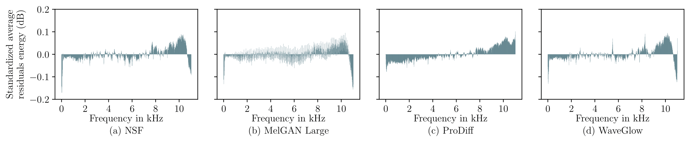

# [Paper Under Revision] Lightweight Detection and Model Attribution of Synthetic Speech via Residual Statistical Fingerprints.

We propose a simple, training-free method for detecting AI-generated speech and attributing it to its source model by leveraging standardized average residuals as distinctive fingerprints. 
Our approach effectively addresses single-model attribution, multi-model attribution, synthetic versus real speech classification, and out-of-domain detection; achieving high accuracy and robustness across diverse speech synthesis systems.

 

This paper [Lightweight Detection and Model Attribution of Synthetic Speech via Residual Statistical Fingerprints](https://github.com/blindconf/fingerprint) is currently under revision. A demo with a selection of fake audio samples from different AI-Generated models employed in our experiments is available online: [Fingerprint Demo](https://blindconf.github.io/fingerprint_demo/).
> As speech generation technologies advance, so do risks of impersonation, misinformation, and spoofing.
> We present a lightweight, training-free method for synthetic speech detection and source model attribution.
> Our method builds on model-specific fingerprints that are computed as the average of the differences between audio signals and their filtered versions, referred to as residuals.
> Leveraging the Mahalanobis distance of the residual for a given audio signal to these model-specific fingerprints allows to identify the source model as well as to distinguish real from fake audio.
> A broad set of experiments across multiple synthesis systems and languages demonstrate a supreme performance of the proposed approach on four tasks: open-world single-model attribution, closed-world multi-model attribution, real vs.~synthetic speech classification, and out-of-domain detection.

### Computing Fingerprints and running the Open-world setting
To compute the fingerprints run the script as follows:
#### Low-pass-filter
```
python run_modelattribution.py \
  --corpus ljspeech \
  --data_path /data/DATASETS/WaveFake/ \
  --real_data_path /data/DATASETS/LJSpeech-1.1/wavs/ \
  --window_size 8 \
  --hop_size 0.125 \
  --seed 40 \
  --batchsize 100
```
#### EncoDec
```
python run_modelattribution.py \
  --corpus ljspeech \
  --data_path /data/DATASETS/WaveFake/ \
  --real_data_path /data/DATASETS/LJSpeech-1.1/wavs/ \
  --window_size 8 \
  --hop_size 0.125 \
  --seed 40 \
  --batchsize 100
```

### Running the Closed-World setting
To compute in a closed-world setting, select one model from x-vector, vfd-resnet, se-resnet, resnet, lcnn, and fingerprints to train the classifier.

#### Multiclass classifier
```
python train_model.py \
  --corpus asvspoof \
  --window_size 25 \
  --hop_size 10 \
  --seed 40 \
  --model se-resnet \
  --classification_type multiclass \
  --batchsize 128
  ```
#### Binary classifier
```
python train_model.py \
  --corpus asvspoof \
  --window_size 25 \
  --hop_size 10 \
  --seed 40 \
  --model se-resnet \
  --classification_type binary \
  --batchsize 128
  ```
